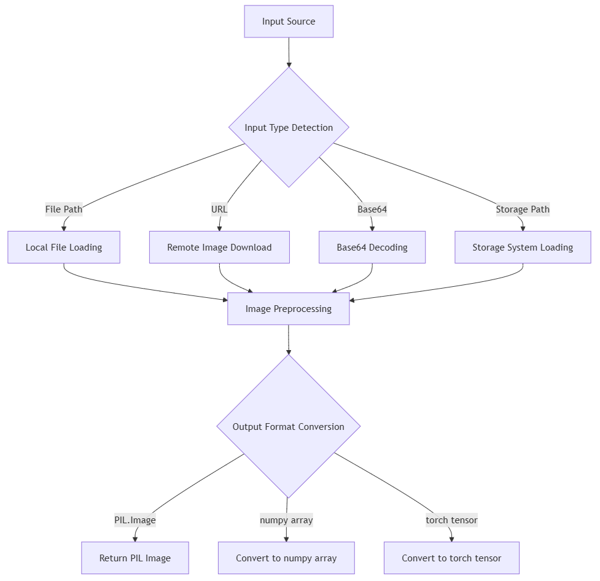

# ImageConverter: Universal Image Processing Tool
[中文文档](README_CN.md) | English

- Supports multiple input sources: local files, URLs, Base64, storage paths
- Supports multiple output formats: PIL.Image, numpy arrays, PyTorch tensors

## Table of Contents
- [Main Features](#1-main-features)
- [Robust Design](#2-robust-design)
- [Usage Scenarios](#3-usage-scenarios)
- [Installation](#4-installation)
- [Quick Start](#5-quick-start)
- [Examples](#6-examples)

### 1. Main Features

1. **Multiple Input Sources Support**:
   - Local file paths
   - Remote URLs
   - Base64 encoded strings
   - Byte data
   - PIL image objects
   - Extensible storage paths

2. **Multiple Output Formats**:
   - PIL.Image.Image
   - numpy.ndarray
   - torch.Tensor (if PyTorch is installed)

3. **Image Preprocessing**:
   - Automatic image resizing (min/max size limits)
   - Mode conversion (e.g., convert to RGB)
   - Format conversion

4. **Utility Methods**:
   - Save images to files
   - Convert to Base64 encoding

### 2. Robust Design

1. **Exception Handling**:
   - Dedicated exception catching and handling for each key step
   - Detailed error logging
   - Clear error messages

2. **Format Compatibility**:
   - Supports multiple image formats (JPEG, PNG, GIF, WEBP, etc.)
   - Optional HEIF/HEIC support
   - Handles different color modes

3. **Input Validation**:
   - Automatic detection of input types (file, URL, Base64, etc.)
   - Verification of file existence
   - Validation of URL validity
   - Validation of Base64 encoding validity

4. **Configurable Parameters**:
   - Customizable image processing parameters
   - Support for overriding default parameters on each call

### 3. Usage Scenarios

ImageConverter is a versatile tool designed to handle a wide range of image processing tasks. Below are comprehensive usage scenarios and how to implement them.

#### 3.1 Basic Image Processing

##### Loading Images from Different Sources

```python
from image_processor import ImageProcessor

processor = ImageProcessor()

# From local file
image_from_file = processor.process_image('path/to/image.jpg')

# From URL
image_from_url = processor.process_image('https://example.com/image.jpg')

# From Base64 string
image_from_base64 = processor.process_image('data:image/jpeg;base64,/9j/4AAQSkZJRg...')

# From bytes
with open('image.jpg', 'rb') as f:
    image_bytes = f.read()
image_from_bytes = processor.process_image(image_bytes)

# From PIL Image
from PIL import Image
pil_image = Image.open('image.jpg')
processed_image = processor.process_image(pil_image)
```

##### Converting Between Different Output Types

```python
# Get as PIL Image
pil_image = processor.process_image('image.jpg', output_type='pil')

# Get as numpy array
numpy_array = processor.process_image('image.jpg', output_type='numpy')

# Get as PyTorch tensor
torch_tensor = processor.process_image('image.jpg', output_type='torch')
```

#### 3.2 Image Resizing and Transformation

##### Controlling Image Dimensions

```python
# Resize to have min dimension of 300px (preserves aspect ratio)
resized_min = processor.process_image('image.jpg', min_size=300)

# Resize to have max dimension of 800px (preserves aspect ratio)
resized_max = processor.process_image('image.jpg', max_size=800)

# Force exact dimensions (may distort image)
from PIL import Image
original = processor.process_image('image.jpg', output_type='pil')
exact_size = original.resize((640, 480), Image.LANCZOS)
```

##### Mode Conversion

```python
# Ensure image is in RGB mode
rgb_image = processor.process_image('image.jpg', convert_to_rgb=True)

# Keep original mode
original_mode = processor.process_image('image.jpg', convert_to_rgb=False)
```

#### 3.3 Saving and Exporting

##### Saving to Different Formats

```python
# Load image
image = processor.process_image('image.jpg')

# Save as JPEG with quality setting
processor.save_image(image, 'output.jpg', format='JPEG', quality=95)

# Save as PNG (lossless)
processor.save_image(image, 'output.png', format='PNG')

# Save as WebP (good compression)
processor.save_image(image, 'output.webp', format='WEBP', quality=90)
```

##### Converting to Base64

```python
# Convert to Base64 string (useful for web applications)
base64_str = processor.to_base64(image, format='JPEG', quality=90)
print(f"Base64 length: {len(base64_str)}")

# Use in HTML
html_img = f''
```

#### 3.4 Web and API Integration

##### Processing Uploaded Images

```python
def handle_upload(uploaded_file):
    processor = ImageProcessor()
    
    # Process the uploaded image
    processed = processor.process_image(
        uploaded_file,
        max_size=1200,
        convert_to_rgb=True
    )
    
    # Create and save a thumbnail
    thumbnail = processed.copy()
    thumbnail.thumbnail((200, 200))
    processor.save_image(thumbnail, 'thumb_' + uploaded_file.name)
    
    # Save the processed image
    processor.save_image(processed, 'processed_' + uploaded_file.name)
    
    return 'processed_' + uploaded_file.name, 'thumb_' + uploaded_file.name
```

##### API Response Preparation

```python
def prepare_image_response(image_path, include_base64=False):
    processor = ImageProcessor()
    
    # Process the image
    image = processor.process_image(image_path, max_size=1000)
    
    # Prepare response data
    response = {
        "dimensions": {
            "width": image.width,
            "height": image.height
        },
        "format": image.format,
        "mode": image.mode,
    }
    
    # Optionally include Base64
    if include_base64:
        response["base64"] = processor.to_base64(image, quality=90)
    
    return response
```

#### 3.5 Batch Processing

##### Converting Multiple Images

```python
import os

def batch_convert(input_dir, output_dir, target_format='WEBP', max_size=800):
    processor = ImageProcessor()
    os.makedirs(output_dir, exist_ok=True)
    
    # Get all image files
    image_extensions = ['.jpg', '.jpeg', '.png', '.gif', '.bmp']
    image_files = []
    
    for file in os.listdir(input_dir):
        if any(file.lower().endswith(ext) for ext in image_extensions):
            image_files.append(os.path.join(input_dir, file))
    
    # Process each image
    for i, image_path in enumerate(image_files):
        try:
            # Get output filename
            filename = os.path.basename(image_path)
            base_name = os.path.splitext(filename)[0]
            output_path = os.path.join(output_dir, f"{base_name}.{target_format.lower()}")
            
            # Process and save
            image = processor.process_image(image_path, max_size=max_size)
            processor.save_image(image, output_path, format=target_format)
            
            print(f"Converted {i+1}/{len(image_files)}: {filename}")
        except Exception as e:
            print(f"Failed to convert {image_path}: {e}")
```

##### Parallel Processing for Large Batches

```python
from multiprocessing import Pool

def process_single_image(args):
    image_path, output_dir, max_size, target_format = args
    processor = ImageProcessor()
    
    try:
        # Get output filename
        filename = os.path.basename(image_path)
        base_name = os.path.splitext(filename)[0]
        output_path = os.path.join(output_dir, f"{base_name}.{target_format.lower()}")
        
        # Process and save
        image = processor.process_image(image_path, max_size=max_size)
        processor.save_image(image, output_path, format=target_format)
        
        return True, image_path
    except Exception as e:
        return False, f"{image_path}: {str(e)}"

def parallel_batch_convert(input_dir, output_dir, workers=4, max_size=800, target_format='WEBP'):
    os.makedirs(output_dir, exist_ok=True)
    
    # Get all image files
    image_extensions = ['.jpg', '.jpeg', '.png', '.gif', '.bmp']
    image_files = []
    
    for file in os.listdir(input_dir):
        if any(file.lower().endswith(ext) for ext in image_extensions):
            image_files.append(os.path.join(input_dir, file))
    
    # Prepare arguments
    args = [(path, output_dir, max_size, target_format) for path in image_files]
    
    # Process in parallel
    with Pool(processes=workers) as pool:
        results = pool.map(process_single_image, args)
    
    # Count successes and failures
    successes = sum(1 for result in results if result[0])
    failures = len(results) - successes
    
    print(f"Processed {len(results)} images: {successes} successful, {failures} failed")
    
    # Return failures for logging
    return [result[1] for result in results if not result[0]]
```

#### 3.6 Machine Learning Integration

##### Preprocessing Images for Neural Networks

```python
def preprocess_for_model(image_path, target_size=(224, 224), normalize=True):
    processor = ImageProcessor()
    
    # Process to torch tensor
    tensor = processor.process_image(
        image_path,
        output_type='torch',
        min_size=min(target_size),
        max_size=max(target_size)
    )
    
    # Resize exactly if needed
    if tensor.shape[1] != target_size[0] or tensor.shape[2] != target_size[1]:
        import torch.nn.functional as F
        tensor = F.interpolate(
            tensor.unsqueeze(0),
            size=target_size,
            mode='bilinear',
            align_corners=False
        ).squeeze(0)
    
    # Normalize (ImageNet stats)
    if normalize:
        import torch
        mean = torch.tensor([0.485, 0.456, 0.406]).view(-1, 1, 1)
        std = torch.tensor([0.229, 0.224, 0.225]).view(-1, 1, 1)
        tensor = (tensor - mean) / std
    
    return tensor
```

##### Creating Dataset for Training

```python
import torch
from torch.utils.data import Dataset

class ImageDataset(Dataset):
    def __init__(self, image_paths, labels=None, transform=None):
        self.processor = ImageProcessor()
        self.image_paths = image_paths
        self.labels = labels
        self.transform = transform
    
    def __len__(self):
        return len(self.image_paths)
    
    def __getitem__(self, idx):
        # Load and process image
        image = self.processor.process_image(
            self.image_paths[idx],
            output_type='pil',
            convert_to_rgb=True
        )
        
        # Apply additional transforms if specified
        if self.transform:
            image = self.transform(image)
        
        # Return with label if available
        if self.labels is not None:
            return image, self.labels[idx]
        return image
```

#### 3.7 Creative Applications

##### Creating Image Collages

```python
def create_image_grid(image_paths, output_path, grid_size=(3, 3), cell_size=(300, 300)):
    processor = ImageProcessor()
    from PIL import Image
    
    # Calculate grid dimensions
    width = grid_size[0] * cell_size[0]
    height = grid_size[1] * cell_size[1]
    
    # Create a blank canvas
    grid = Image.new('RGB', (width, height), color='white')
    
    # Fill the grid with images
    for i, path in enumerate(image_paths):
        if i >= grid_size[0] * grid_size[1]:
            break  # Grid is full
        
        try:
            # Calculate position
            row = i // grid_size[0]
            col = i % grid_size[0]
            
            # Process and resize image
            img = processor.process_image(path, output_type='pil')
            img = img.resize(cell_size, Image.LANCZOS)
            
            # Paste into grid
            position = (col * cell_size[0], row * cell_size[1])
            grid.paste(img, position)
            
        except Exception as e:
            print(f"Error processing {path}: {e}")
    
    # Save the grid
    processor.save_image(grid, output_path)
    return output_path
```

##### Applying Creative Filters

```python
def apply_artistic_filter(image_path, output_path, filter_type='sketch'):
    processor = ImageProcessor()
    from PIL import Image, ImageEnhance, ImageFilter, ImageOps
    
    # Load image
    img = processor.process_image(image_path, output_type='pil')
    
    # Apply filter
    if filter_type == 'sketch':
        # Create sketch effect
        gray = img.convert('L')
        inverted = ImageOps.invert(gray)
        blurred = inverted.filter(ImageFilter.GaussianBlur(radius=10))
        result = Image.blend(gray, blurred, alpha=0.5)
    
    elif filter_type == 'watercolor':
        # Create watercolor effect
        blurred = img.filter(ImageFilter.GaussianBlur(radius=2))
        enhancer = ImageEnhance.Color(blurred)
        result = enhancer.enhance(1.5)
    
    elif filter_type == 'vintage':
        # Create vintage/sepia effect
        gray = img.convert('L')
        result = ImageOps.colorize(gray, "#704214", "#C0A080")
    
    else:
        result = img  # No filter
    
    # Save result
    processor.save_image(result, output_path)
    return output_path
```

### 4. Installation

```bash
# Clone the repository
git clone https://github.com/yourusername/ImageConverter.git
cd ImageConverter

# Install dependencies
pip install -r requirements.txt
```

Requirements:
```
# Basic dependencies
pillow>=9.0.0
numpy>=1.20.0
requests>=2.25.0

# Optional dependencies (uncomment to install)
# torch>=1.10.0  # For PyTorch tensor support
# pillow_heif>=0.4.0  # For HEIF/HEIC format support
```

### 5. Quick Start

```python
from image_processor import ImageProcessor

# Create processor instance
processor = ImageProcessor()

# Load image from file
image = processor.process_image('path/to/image.jpg')

# Resize image while preserving aspect ratio
resized = processor.process_image('path/to/image.jpg', max_size=800)

# Save processed image
processor.save_image(resized, 'resized_image.jpg', quality=90)

# Convert to Base64 for web use
base64_str = processor.to_base64(image)
```

### 6. Examples

For more detailed examples, check out the `examples` directory which contains scripts demonstrating various use cases:

- Basic usage
- Saving and converting
- Web image processing
- Base64 encoding/decoding
- Common tasks
- Advanced processing
- Batch operations
- Special effects

```bash
# Run an example
cd examples
python basic_usage.py
```

See the [examples/README.md](examples/README.md) for detailed information about each example.
