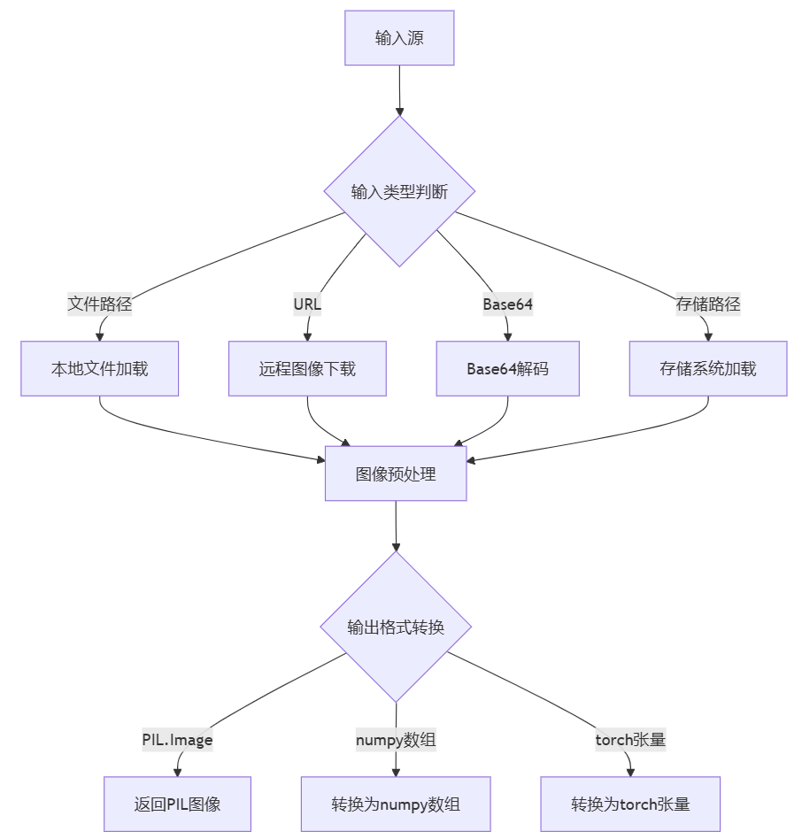

# ImageConverter: 通用图像处理工具


- 支持多种输入源：本地文件、URL、Base64、存储路径
- 支持多种输出格式：PIL.Image、numpy数组、PyTorch张量

## 目录
- [主要特性](#1-主要特性)
- [健壮设计](#2-健壮设计)
- [使用场景](#3-使用场景)
- [安装与依赖](#4-安装与依赖)
- [快速开始](#5-快速开始)
- [示例](#6-示例)
- [中文用户指南](#7-中文用户指南)
- [常见问题](#8-常见问题)

### 1. 主要特性

1. **多种输入源支持**:
   - 本地文件路径
   - 远程URL
   - Base64编码字符串
   - 字节数据
   - PIL图像对象
   - 可扩展的存储路径

2. **多种输出格式**:
   - PIL.Image.Image
   - numpy.ndarray
   - torch.Tensor (如果安装了PyTorch)

3. **图像预处理**:
   - 自动图像大小调整（最小/最大尺寸限制）
   - 模式转换（例如，转换为RGB）
   - 格式转换

4. **实用方法**:
   - 将图像保存到文件
   - 转换为Base64编码

### 2. 健壮设计

1. **异常处理**:
   - 针对每个关键步骤的专门异常捕获和处理
   - 详细的错误日志
   - 清晰的错误信息

2. **格式兼容性**:
   - 支持多种图像格式（JPEG、PNG、GIF、WEBP等）
   - 可选的HEIF/HEIC支持
   - 处理不同的颜色模式

3. **输入验证**:
   - 自动检测输入类型（文件、URL、Base64等）
   - 验证文件是否存在
   - 验证URL有效性
   - 验证Base64编码有效性

4. **可配置参数**:
   - 可自定义的图像处理参数
   - 支持在每次调用时覆盖默认参数

### 3. 使用场景

ImageConverter是一个多功能工具，设计用于处理各种图像处理任务。以下是全面的使用场景和实现方法。

#### 3.1 基本图像处理

##### 从不同来源加载图像

```python
from image_processor import ImageProcessor

processor = ImageProcessor()

# 从本地文件加载
image_from_file = processor.process_image('path/to/image.jpg')

# 从URL加载
image_from_url = processor.process_image('https://example.com/image.jpg')

# 从Base64字符串加载
image_from_base64 = processor.process_image('data:image/jpeg;base64,/9j/4AAQSkZJRg...')

# 从字节加载
with open('image.jpg', 'rb') as f:
    image_bytes = f.read()
image_from_bytes = processor.process_image(image_bytes)

# 从PIL Image加载
from PIL import Image
pil_image = Image.open('image.jpg')
processed_image = processor.process_image(pil_image)
```

##### 在不同输出类型之间转换

```python
# 获取为PIL图像
pil_image = processor.process_image('image.jpg', output_type='pil')

# 获取为numpy数组
numpy_array = processor.process_image('image.jpg', output_type='numpy')

# 获取为PyTorch张量
torch_tensor = processor.process_image('image.jpg', output_type='torch')
```

#### 3.2 图像大小调整和变换

##### 控制图像尺寸

```python
# 调整至最小尺寸为300像素（保持宽高比）
resized_min = processor.process_image('image.jpg', min_size=300)

# 调整至最大尺寸为800像素（保持宽高比）
resized_max = processor.process_image('image.jpg', max_size=800)

# 强制指定精确尺寸（可能会扭曲图像）
from PIL import Image
original = processor.process_image('image.jpg', output_type='pil')
exact_size = original.resize((640, 480), Image.LANCZOS)
```

##### 模式转换

```python
# 确保图像为RGB模式
rgb_image = processor.process_image('image.jpg', convert_to_rgb=True)

# 保持原始模式
original_mode = processor.process_image('image.jpg', convert_to_rgb=False)
```

#### 3.3 保存和导出

##### 保存为不同格式

```python
# 加载图像
image = processor.process_image('image.jpg')

# 保存为JPEG并设置质量
processor.save_image(image, 'output.jpg', format='JPEG', quality=95)

# 保存为PNG（无损）
processor.save_image(image, 'output.png', format='PNG')

# 保存为WebP（良好的压缩比）
processor.save_image(image, 'output.webp', format='WEBP', quality=90)
```

##### 转换为Base64

```python
# 转换为Base64字符串（对Web应用有用）
base64_str = processor.to_base64(image, format='JPEG', quality=90)
print(f"Base64长度: {len(base64_str)}")

# 在HTML中使用
html_img = f''
```

#### 3.4 Web和API集成

##### 处理上传的图像

```python
def handle_upload(uploaded_file):
    processor = ImageProcessor()
    
    # 处理上传的图像
    processed = processor.process_image(
        uploaded_file,
        max_size=1200,
        convert_to_rgb=True
    )
    
    # 创建并保存缩略图
    thumbnail = processed.copy()
    thumbnail.thumbnail((200, 200))
    processor.save_image(thumbnail, 'thumb_' + uploaded_file.name)
    
    # 保存处理后的图像
    processor.save_image(processed, 'processed_' + uploaded_file.name)
    
    return 'processed_' + uploaded_file.name, 'thumb_' + uploaded_file.name
```

##### API响应准备

```python
def prepare_image_response(image_path, include_base64=False):
    processor = ImageProcessor()
    
    # 处理图像
    image = processor.process_image(image_path, max_size=1000)
    
    # 准备响应数据
    response = {
        "dimensions": {
            "width": image.width,
            "height": image.height
        },
        "format": image.format,
        "mode": image.mode,
    }
    
    # 可选包含Base64
    if include_base64:
        response["base64"] = processor.to_base64(image, quality=90)
    
    return response
```

#### 3.5 批处理

##### 转换多个图像

```python
import os

def batch_convert(input_dir, output_dir, target_format='WEBP', max_size=800):
    processor = ImageProcessor()
    os.makedirs(output_dir, exist_ok=True)
    
    # 获取所有图像文件
    image_extensions = ['.jpg', '.jpeg', '.png', '.gif', '.bmp']
    image_files = []
    
    for file in os.listdir(input_dir):
        if any(file.lower().endswith(ext) for ext in image_extensions):
            image_files.append(os.path.join(input_dir, file))
    
    # 处理每个图像
    for i, image_path in enumerate(image_files):
        try:
            # 获取输出文件名
            filename = os.path.basename(image_path)
            base_name = os.path.splitext(filename)[0]
            output_path = os.path.join(output_dir, f"{base_name}.{target_format.lower()}")
            
            # 处理并保存
            image = processor.process_image(image_path, max_size=max_size)
            processor.save_image(image, output_path, format=target_format)
            
            print(f"已转换 {i+1}/{len(image_files)}: {filename}")
        except Exception as e:
            print(f"转换失败 {image_path}: {e}")
```

##### 大批量并行处理

```python
from multiprocessing import Pool

def process_single_image(args):
    image_path, output_dir, max_size, target_format = args
    processor = ImageProcessor()
    
    try:
        # 获取输出文件名
        filename = os.path.basename(image_path)
        base_name = os.path.splitext(filename)[0]
        output_path = os.path.join(output_dir, f"{base_name}.{target_format.lower()}")
        
        # 处理并保存
        image = processor.process_image(image_path, max_size=max_size)
        processor.save_image(image, output_path, format=target_format)
        
        return True, image_path
    except Exception as e:
        return False, f"{image_path}: {str(e)}"

def parallel_batch_convert(input_dir, output_dir, workers=4, max_size=800, target_format='WEBP'):
    os.makedirs(output_dir, exist_ok=True)
    
    # 获取所有图像文件
    image_extensions = ['.jpg', '.jpeg', '.png', '.gif', '.bmp']
    image_files = []
    
    for file in os.listdir(input_dir):
        if any(file.lower().endswith(ext) for ext in image_extensions):
            image_files.append(os.path.join(input_dir, file))
    
    # 准备参数
    args = [(path, output_dir, max_size, target_format) for path in image_files]
    
    # 并行处理
    with Pool(processes=workers) as pool:
        results = pool.map(process_single_image, args)
    
    # 统计成功和失败
    successes = sum(1 for result in results if result[0])
    failures = len(results) - successes
    
    print(f"已处理 {len(results)} 张图像: {successes} 成功, {failures} 失败")
    
    # 返回失败的结果用于记录
    return [result[1] for result in results if not result[0]]
```

#### 3.6 机器学习集成

##### 为神经网络预处理图像

```python
def preprocess_for_model(image_path, target_size=(224, 224), normalize=True):
    processor = ImageProcessor()
    
    # 处理为torch张量
    tensor = processor.process_image(
        image_path,
        output_type='torch',
        min_size=min(target_size),
        max_size=max(target_size)
    )
    
    # 如果需要，精确调整大小
    if tensor.shape[1] != target_size[0] or tensor.shape[2] != target_size[1]:
        import torch.nn.functional as F
        tensor = F.interpolate(
            tensor.unsqueeze(0),
            size=target_size,
            mode='bilinear',
            align_corners=False
        ).squeeze(0)
    
    # 标准化（ImageNet统计数据）
    if normalize:
        import torch
        mean = torch.tensor([0.485, 0.456, 0.406]).view(-1, 1, 1)
        std = torch.tensor([0.229, 0.224, 0.225]).view(-1, 1, 1)
        tensor = (tensor - mean) / std
    
    return tensor
```

##### 创建训练数据集

```python
import torch
from torch.utils.data import Dataset

class ImageDataset(Dataset):
    def __init__(self, image_paths, labels=None, transform=None):
        self.processor = ImageProcessor()
        self.image_paths = image_paths
        self.labels = labels
        self.transform = transform
    
    def __len__(self):
        return len(self.image_paths)
    
    def __getitem__(self, idx):
        # 加载并处理图像
        image = self.processor.process_image(
            self.image_paths[idx],
            output_type='pil',
            convert_to_rgb=True
        )
        
        # 如果指定了，应用额外的变换
        if self.transform:
            image = self.transform(image)
        
        # 如果有标签，返回与标签一起
        if self.labels is not None:
            return image, self.labels[idx]
        return image
```

#### 3.7 创意应用

##### 创建图像拼贴

```python
def create_image_grid(image_paths, output_path, grid_size=(3, 3), cell_size=(300, 300)):
    processor = ImageProcessor()
    from PIL import Image
    
    # 计算网格尺寸
    width = grid_size[0] * cell_size[0]
    height = grid_size[1] * cell_size[1]
    
    # 创建空白画布
    grid = Image.new('RGB', (width, height), color='white')
    
    # 用图像填充网格
    for i, path in enumerate(image_paths):
        if i >= grid_size[0] * grid_size[1]:
            break  # 网格已满
        
        try:
            # 计算位置
            row = i // grid_size[0]
            col = i % grid_size[0]
            
            # 处理并调整图像大小
            img = processor.process_image(path, output_type='pil')
            img = img.resize(cell_size, Image.LANCZOS)
            
            # 粘贴到网格
            position = (col * cell_size[0], row * cell_size[1])
            grid.paste(img, position)
            
        except Exception as e:
            print(f"处理 {path} 时出错: {e}")
    
    # 保存网格
    processor.save_image(grid, output_path)
    return output_path
```

##### 应用创意滤镜

```python
def apply_artistic_filter(image_path, output_path, filter_type='sketch'):
    processor = ImageProcessor()
    from PIL import Image, ImageEnhance, ImageFilter, ImageOps
    
    # 加载图像
    img = processor.process_image(image_path, output_type='pil')
    
    # 应用滤镜
    if filter_type == 'sketch':
        # 创建素描效果
        gray = img.convert('L')
        inverted = ImageOps.invert(gray)
        blurred = inverted.filter(ImageFilter.GaussianBlur(radius=10))
        result = Image.blend(gray, blurred, alpha=0.5)
    
    elif filter_type == 'watercolor':
        # 创建水彩效果
        blurred = img.filter(ImageFilter.GaussianBlur(radius=2))
        enhancer = ImageEnhance.Color(blurred)
        result = enhancer.enhance(1.5)
    
    elif filter_type == 'vintage':
        # 创建复古/褐色效果
        gray = img.convert('L')
        result = ImageOps.colorize(gray, "#704214", "#C0A080")
    
    else:
        result = img  # 无滤镜
    
    # 保存结果
    processor.save_image(result, output_path)
    return output_path
```

### 4. 安装与依赖

```bash
# 克隆仓库
git clone https://github.com/yourusername/ImageConverter.git
cd ImageConverter

# 安装依赖
pip install -r requirements.txt
```

依赖项:
```
# 基本依赖
pillow>=9.0.0
numpy>=1.20.0
requests>=2.25.0

# 可选依赖 (取消注释以安装)
# torch>=1.10.0  # 用于PyTorch张量支持
# pillow_heif>=0.4.0  # 用于HEIF/HEIC格式支持
```

### 5. 快速开始

```python
from image_processor import ImageProcessor

# 创建处理器实例
processor = ImageProcessor()

# 从本地文件加载图像
image = processor.process_image('path/to/image.jpg')

# 调整大小并保存
resized = processor.process_image('path/to/image.jpg', max_size=800)
processor.save_image(resized, 'resized_image.jpg', quality=90)

# 转换为Base64
base64_str = processor.to_base64(image)
```

### 6. 示例

有关更详细的示例，请查看`examples`目录，其中包含演示各种用例的脚本：

- 基本用法
- 保存和转换
- Web图像处理
- Base64编码/解码
- 常见任务
- 高级处理
- 批处理操作
- 特殊效果

```bash
# 运行示例
cd examples
python basic_usage.py
```

参见[examples/README.md](examples/README.md)获取每个示例的详细信息。

### 7. 中文用户指南

#### 7.1 为什么选择ImageConverter

ImageConverter的设计目标是提供一个简单但功能强大的图像处理工具，无需了解底层图像处理库的复杂细节。它特别适合以下场景：

- **Web应用开发**：处理用户上传的图像或从网络获取的图像
- **机器学习预处理**：准备用于训练或推理的图像数据
- **批量图像处理**：高效处理大量图像文件
- **多格式转换**：在不同图像格式之间无缝转换

#### 7.2 与其他库的比较

与其他流行的图像处理库相比，ImageConverter提供了以下优势：

- **简化接口**：单一入口点处理多种输入和输出类型
- **自动化处理**：自动检测图像类型和处理需求
- **全面的错误处理**：避免程序因图像处理错误而崩溃
- **内置最佳实践**：默认参数设置符合大多数使用场景

#### 7.3 常见使用场景示例

**场景1：Web应用中处理上传图像**
```python
# 处理用户上传的图像并创建缩略图
def process_uploaded_image(uploaded_file_path):
    processor = ImageProcessor()
    
    # 处理原始图像
    image = processor.process_image(
        uploaded_file_path,
        max_size=1200,  # 限制最大尺寸
        convert_to_rgb=True  # 确保为RGB模式
    )
    
    # 保存处理后的图像
    processed_path = "processed_" + os.path.basename(uploaded_file_path)
    processor.save_image(image, processed_path, quality=85)
    
    # 创建缩略图
    thumbnail = image.copy()
    thumbnail.thumbnail((200, 200))
    thumb_path = "thumb_" + os.path.basename(uploaded_file_path)
    processor.save_image(thumbnail, thumb_path)
    
    return processed_path, thumb_path
```

**场景2：批量转换图像格式**
```python
# 将目录中所有JPG图像转换为WebP格式
def convert_all_to_webp(input_dir, output_dir):
    processor = ImageProcessor()
    os.makedirs(output_dir, exist_ok=True)
    
    for filename in os.listdir(input_dir):
        if filename.lower().endswith(('.jpg', '.jpeg')):
            input_path = os.path.join(input_dir, filename)
            output_path = os.path.join(
                output_dir, 
                os.path.splitext(filename)[0] + '.webp'
            )
            
            try:
                image = processor.process_image(input_path)
                processor.save_image(image, output_path, format='WEBP')
                print(f"转换成功: {output_path}")
            except Exception as e:
                print(f"转换 {filename} 失败: {e}")
```

### 8. 常见问题

#### 8.1 性能优化

**问题**：处理大量图像时性能较慢，如何优化？

**解答**：
- 使用批处理模式而不是循环单个处理
- 对于简单操作，可以考虑使用多线程或多进程
- 设置适当的图像尺寸限制，避免处理不必要的大图像
- 如果主要在PyTorch环境中使用，可以直接使用GPU加速

```python
# 使用多进程处理大量图像示例
from multiprocessing import Pool

def process_single_image(image_path):
    processor = ImageProcessor()
    try:
        image = processor.process_image(image_path, max_size=800)
        output_path = "processed_" + os.path.basename(image_path)
        processor.save_image(image, output_path)
        return True
    except Exception as e:
        print(f"处理 {image_path} 失败: {e}")
        return False

# 使用进程池并行处理
with Pool(processes=4) as pool:
    results = pool.map(process_single_image, image_paths)
```

#### 8.2 内存问题

**问题**：处理大图像时出现内存错误

**解答**：
- 设置合理的`max_size`参数限制图像尺寸
- 如果需要处理原始大小，考虑分块处理
- 处理完图像后立即保存并删除中间变量
- 在循环中处理大量图像时，确保每次迭代后释放内存

#### 8.3 图像质量问题

**问题**：保存的图像质量不理想

**解答**：
- JPEG格式时，提高`quality`参数值（最高100）
- 对于需要无损保存的图像，使用PNG或WEBP格式
- 调整尺寸时，使用`Image.LANCZOS`重采样方法
- 避免多次保存和加载JPEG图像，这会导致累积质量损失 